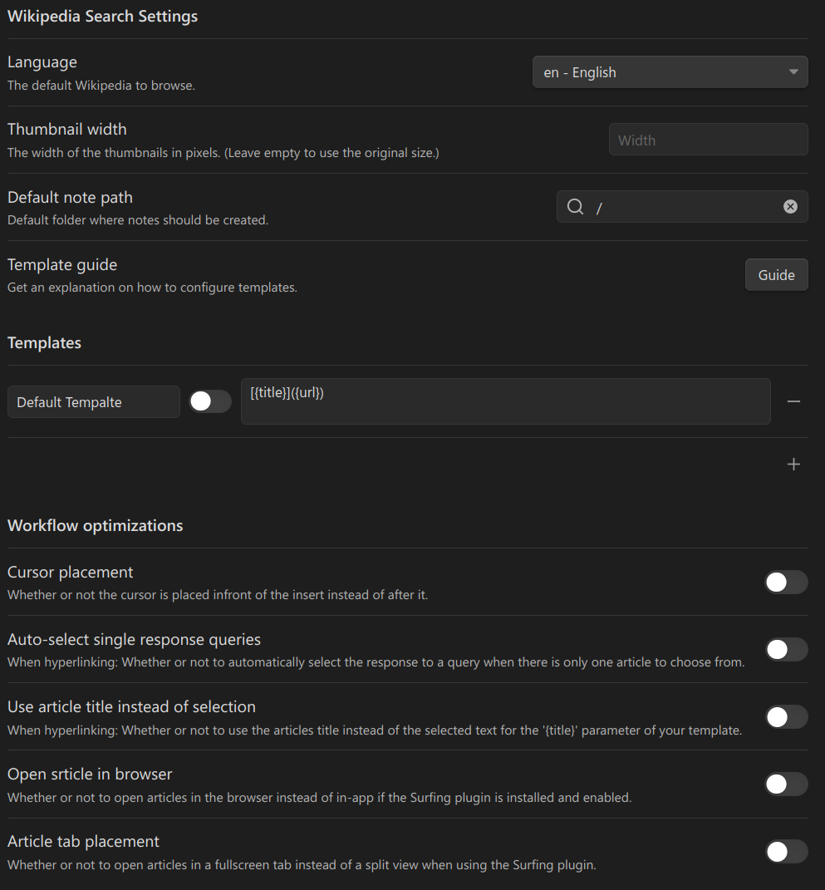

# Obsidian Wikipedia Search Plugin

An [Obsidian.md](https://obsidian.md/) plugin to quickly search, link and open Wikipedia articles directly in Obsidian and in your notes.

_Don't worry about this project being "inactive". It's not inactive. It's done :)  
(at least until there aren't any new feature requests)_

## Key [Features](#features)

- Linking Wikipedia articles in all languages.
- Opening articles and links directly in Obsidian (using the [Surfing plugin](https://github.com/PKM-er/Obsidian-Surfing)).
- Hyperlinking selected text.
- Pasting the articles introduction.
- Using different templates for the insert.
- Creating notes for articles.

### [Demo Video](https://raw.githubusercontent.com/StrangeGirlMurph/obsidian-wikipedia-search/master/assets/demo.mp4)

https://github.com/StrangeGirlMurph/obsidian-wikipedia-search/assets/62220780/e49a9474-f124-4697-9d7b-4874582abfe7

## Table of contents

- [Installation](#installation)
  - [From the community plugins list](#from-the-community-plugins-list)
  - [Manual Installation](#manual-installation)
- [Usage](#usage)
  - [Getting Started](#getting-started)
  - [Commands](#commands)
  - [Features](#features)
- [Settings](#settings)
- [Questions \& Contributions](#questions--contributions)
- [License](#license)

## Installation

### From the community plugins list

1. Search under the Community Plugins in the settings for it and click install.
2. Enable the plugin (from the installed plugin list).  
   

### Manual Installation

1. Create the directory `[path-to-vault]/.obsidian/plugins/wikipedia-search`.
2. Download the `main.js` and `mainfest.json` from the [latest release](https://github.com/StrangeGirlMurph/obsidian-wikipedia-search/releases) and put them in the created directory.
3. Enable the plugin.

## Usage

### Getting Started

1. Install the plugin and enable it.
2. Set your language and the template for the insert in the settings (and the other settings as well if you want).
3. Start searching/linking/reading :)

### Commands

The plugin comes with 2 commands:

- `Link Article`
- `Open Article`

You can access these commands over the command palette (`CTRL+P`). The `Open Article` also has its own little button in the ribbon menu on the left (the Wikipedia Logo). Of course you can also set custom hotkeys for the commands in your settings.

### Features

- **Basic links**  
   Just use the `Link Article` command somewhere in your file (in edit mode). If you want that action to create a new note for this, change the templates settings.
- **Opening Articles**  
   The plugin lets you search for Wikipedia articles and open them in your browser or directly in Obsidian with the help of the [Surfing plugin](https://github.com/PKM-er/Obsidian-Surfing)! Just use the `Open Article` command (either via the command palette or the button in the ribbon menu). If you want to open the article in Obsidian you first have to [install](obsidian://show-plugin?id=surfing) the amazing Surfing plugin from the community plugin list (note: this is only available on desktop).
- **Hyperlinking**  
   Select some text and use `Link Article`. The selected text will be the `{title}` parameter in your template (if you haven't changed that behaviour in the settings).
- **Search different languages**  
   In the search bar you can start with a valid Wikipedia language code followed by a semicolon (e.g. `da:albert einstein`). This will let you search articles in all kinds of languages. (spaces don't matter)
- **Include the articles intro** (the first paragraph)  
   Add `{intro}` somewhere in your template in the settings. This will be replaced with the articles introduction. (Note: It can be pretty long!)
- **Multiple templates**  
   Add multiple template options in the settings and dynamically select the one you want for your specific use case.
- **Small workflow optimization settings**  
   Go through the settings to optimize the plugin for your specific workflow.

## Settings

The available settings and their default values:

## Questions & Contributions

Feel free to ask me and the community if you have any questions in the [discussion tab](https://github.com/StrangeGirlMurph/obsidian-wikipedia-search/discussions).
I am happy to hear your feature requests! Just create an issue if you have a good idea.

If you want to contribute you can do that simply by creating issues and pull requests :)

## License

This project is licensed under the [Humane Software License](https://github.com/StrangeGirlMurph/The-Humane-Software-License) see [LICENSE](LICENSE).
